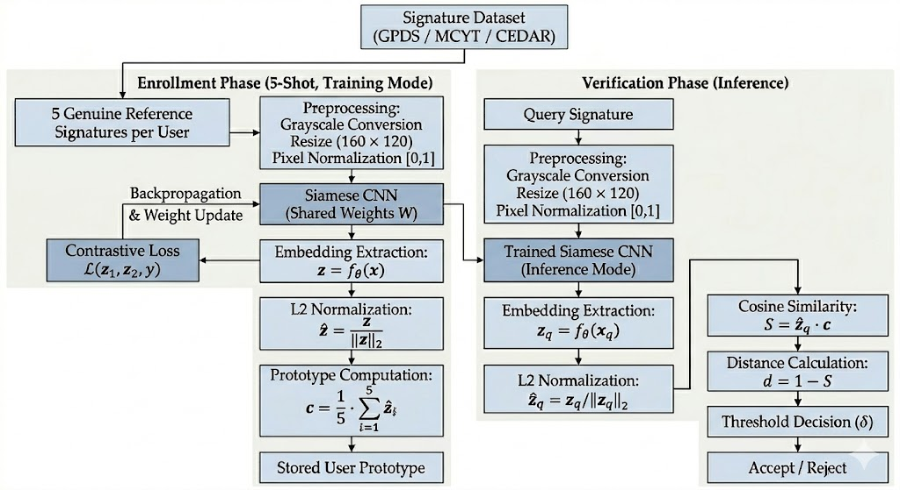
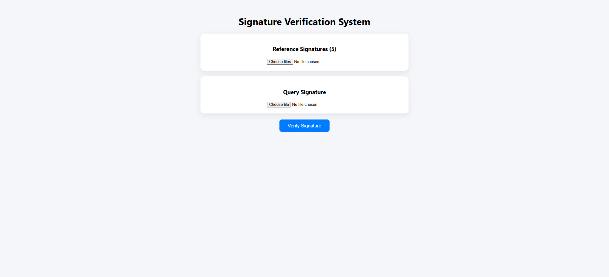
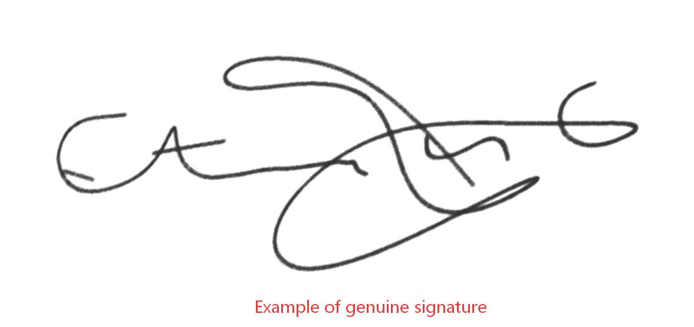
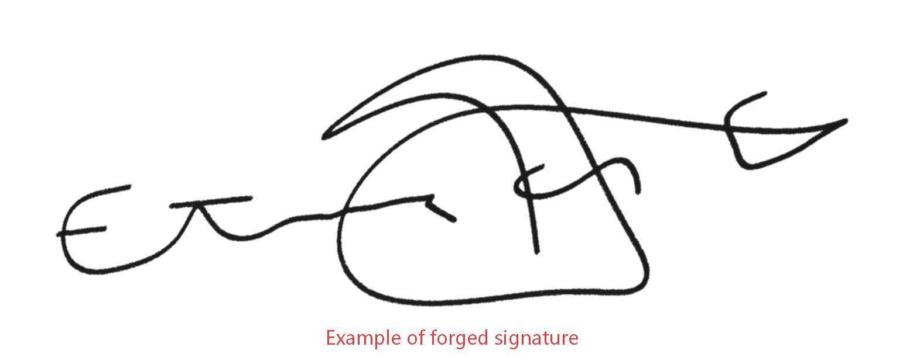
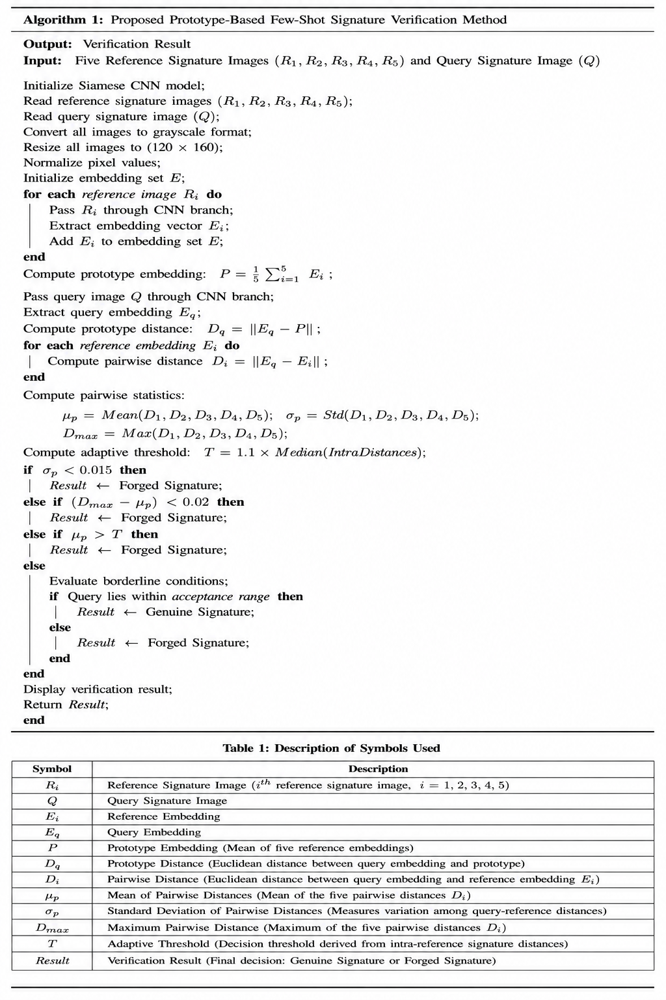

# Few-Shot Offline Signature Verification using Siamese CNN

> An end-to-end offline signature verification system based on Few-Shot Metric Learning using a Siamese Convolutional Neural Network (CNN), Prototype-Based Verification, and Adaptive Thresholding.

---

## Overview

Offline signature verification is an important biometric authentication technique used in banking, legal documentation, insurance, and identity verification. Traditional deep learning models generally require a large number of genuine signatures for each user, making them difficult to deploy in real-world scenarios.

This project presents a **Few-Shot Offline Signature Verification System** that requires only **five genuine reference signatures** to verify a query signature. The system extracts discriminative feature embeddings using a **Siamese Convolutional Neural Network (CNN)**, constructs a **prototype embedding** from the reference signatures, and verifies the query signature using an **adaptive threshold** derived from intra-reference signature distances.

The application provides a complete web-based interface developed using **React.js** and a backend REST API built with **Flask**, enabling efficient real-time signature verification.

---

# Features

- Offline Signature Verification
- Few-Shot Learning using Five Reference Signatures
- Siamese CNN Feature Extraction
- Prototype-Based Verification
- Adaptive Threshold Calculation
- Contrastive Loss Training
- Flask REST API
- React.js Web Interface
- Real-Time Signature Verification
- CPU Compatible Deployment

---

# System Architecture

<p align="center">
  
</p>
---

# Project Workflow

```
Reference Signatures (5)
          │
          ▼
Image Preprocessing
(Grayscale → Resize → Normalize)
          │
          ▼
Siamese CNN
(Feature Extraction)
          │
          ▼
Embedding Generation
          │
          ▼
Prototype Creation
          │
          ▼
Adaptive Threshold Calculation
          │
          ▼
Query Signature
          │
          ▼
Distance Calculation
          │
          ▼
Decision
(Genuine / Forged)
```

---

# Technology Stack

## Programming Languages

- Python
- JavaScript
- HTML
- CSS

## Frameworks

- Flask
- React.js

## Deep Learning Framework

- PyTorch
- Torchvision

## Libraries

- NumPy
- OpenCV
- Pillow
- Matplotlib
- Scikit-learn
- TorchSummary

---

# Datasets

The proposed framework was developed and evaluated using three publicly available offline signature datasets.

| Dataset | Description |
|----------|-------------|
| GPDS-300 | Large-scale offline signature dataset |
| CEDAR | Benchmark offline signature dataset |
| MCYT-100 | Multilingual offline signature dataset |

> **Note:** The datasets are not included in this repository due to licensing restrictions and their large storage requirements.

---

# Model Architecture

The proposed verification model consists of:

- Convolution Layers
- ReLU Activation
- Max Pooling Layers
- Fully Connected Layer
- L2 Normalized Embeddings
- Contrastive Loss
- Prototype-Based Verification

# Training Configuration

| Parameter | Value |
|------------|--------|
| Framework | PyTorch |
| Network | Siamese CNN |
| Optimizer | Adam |
| Learning Rate | 0.0005 |
| Loss Function | Contrastive Loss |
| Batch Size | 16 |
| Maximum Epochs | 50 |
| Early Stopping | Patience = 5 |
| Best Model Selection | Lowest Training Loss |
| Similarity Measure | Euclidean Distance |
| Embedding Normalization | L2 Normalization |
| Verification Method | Prototype-Based Verification |
| Decision Threshold | Adaptive Threshold |
| Deployment Support | CPU / GPU |

--

# Performance Evaluation

The final prototype-based verification framework was evaluated using three benchmark offline signature datasets.

| Dataset | Accuracy (%) |
|----------|-------------:|
| GPDS-300 | **94.16** |
| CEDAR | **93.07** |
| MCYT-100 | **93.44** |

The proposed framework consistently achieved over **93% verification accuracy** while requiring only **five genuine reference signatures**, demonstrating the effectiveness of few-shot metric learning for offline signature verification.

---

# Application Screenshots

## Home Page

<p align="center">
  
</p>

---

## Genuine Signature Verification

<p align="center">
  
</p>

---

## Forged Signature Verification

<p align="center">
  
</p>

---

## Verification Result

<p align="center">
  
</p>

<p align="center">
  
</p>

---

## Algorithm

<p align="center">
  
</p>

---

# Project Structure

```
few-shot-offline-signature-verification
│
├── app.py
├── baseline_cnn.py
├── contrastive_loss.py
├── dataset_loader.py
├── model_summary.py
├── proto_evaluation.py
├── siamese_dataset.py
├── siamese_network.py
├── train_baseline.py
├── train_siamese.py
├── test_baseline.py
├── test_siamese.py
│
├── README.md
├── requirements.txt
├── .gitignore
│
├── models/
│      siamese_bestgpds.pth
│
├── screenshots/
│
└── signature-ui/
```

---

# Installation

Clone the repository

```bash
git clone https://github.com/shruti662/few-shot-offline-signature-verification.git
```

Navigate to the project directory

```bash
cd few-shot-offline-signature-verification
```

Create a virtual environment

```bash
python -m venv venv
```

Activate the virtual environment

### Windows

```bash
venv\Scripts\activate
```

### Linux/macOS

```bash
source venv/bin/activate
```

Install the required packages

```bash
pip install -r requirements.txt
```

Start the Flask backend

```bash
python app.py
```

Run the React frontend

```bash
cd signature-ui
npm install
npm start
```

---

# How the System Works

1. Upload five genuine reference signatures.
2. Upload one query signature.
3. Images are preprocessed.
4. The Siamese CNN extracts feature embeddings.
5. A prototype embedding is generated from the reference signatures.
6. An adaptive threshold is computed using intra-reference signature distances.
7. The query signature is compared with the prototype.
8. The system classifies the query as **Genuine**, **Forged**, or **Borderline**.

---

# Future Improvements

- Transformer-based signature embeddings
- Mobile application support
- Cloud deployment
- Online signature verification
- Explainable AI visualization
- Cross-dataset evaluation on larger benchmark datasets
